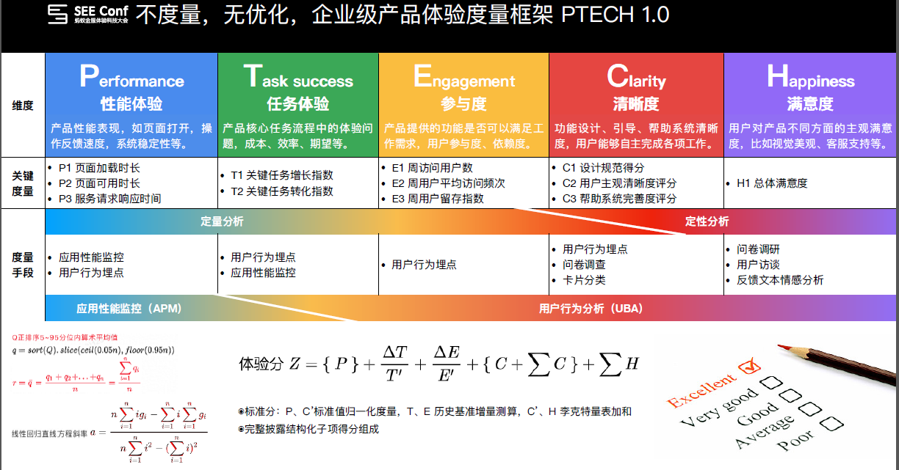

# 蚂蚁金服 PTECH 用户体验量化模型

> 在谷歌 HEART 模型的灵感基础上，以体验科技助力业务增长为愿景，产出了适用于企业级产品的 PTECH 模型。该模型历经2次发布，PTECH 模型由 1.0 版的 TECH 框架，加入了系统性能维度，并可直接计算产品体验分。发布于2019年 SEE CONF 蚂蚁金服体验科技大会。

# 整体框架

### Task Success(任务成功)

主要聚焦于产品核心任务流程中的体验问题。可以采用定性、定量，或者两者结合的方式，最终来反映体验的细节问题

### Engagement(参与度)

产品能够提供的需求和用户预想之间距离有多远

### Clarity(清晰度)

引导、帮助清晰，用户是否能够顺利完成所想做的事情

### Happiness(愉悦度)

用户对产品及其他方面的满意度，比如视觉外观等

### Performance(性能)

监控性能的指标有很多，其中最影响用户感知的指标是首屏渲染时间（FMP），指用户从发出请求到看到控制台主要内容的时间。其次，还包括页面请求响应时间、API 请求响应时间等指标。
